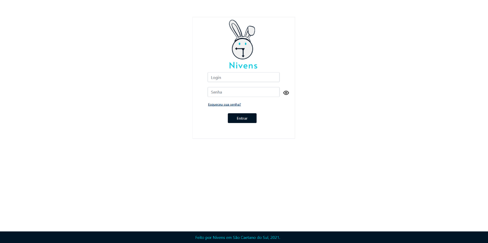

# Administração do sistema

Para receber um login e senha de acesso, entre em contato com o Administrador de Sistemas da sua empresa para que ele(a) possa gerar credenciais específicas para você gestor(a).

Assim que receber suas credenciais de acesso insira-as na tela de login e clique em **Enviar**: 

Caso você tenha esquecido sua senha acesse [aqui](senha.md).

**Nunca compartilhe suas credenciais de acesso.**