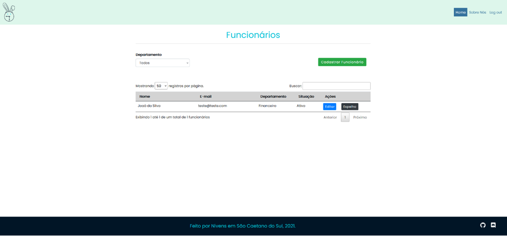

# Novo Cadastro

Para realizar o cadastro de um novo colaborador, vá para a tela **Funcionários** e clique na opção **Cadastrar Funcionário**:

A seguinte tela se abrirá:

Insira o Nome completo, E-mail e Celular de contato, Cidade, Situação, se Ativo ou Inativo e Departamento do novo membro. A opção Gestor já vem pré-carregada.

Revise as informações inseridas e, quando estiver satisfeito(a) clique em **Salvar**.