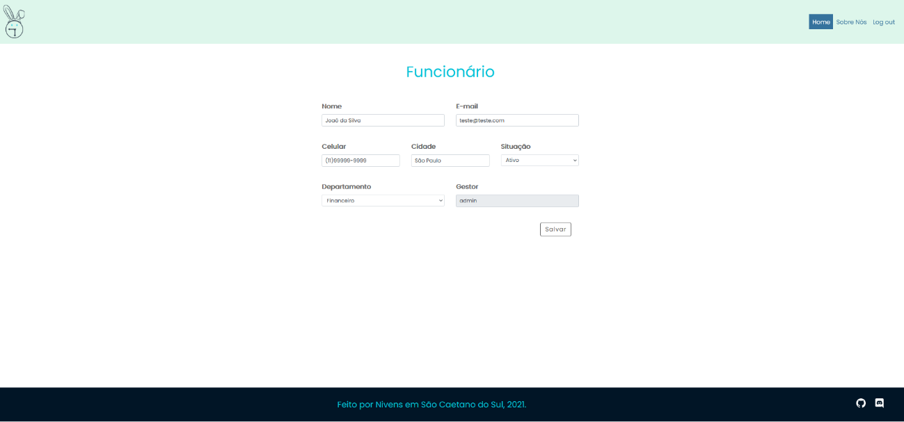

# Editar Funcionário

Na tela inicial do sistema, logo após o login, estão listados todos os funcionários cadastrados no sistema:

Se desejar realizar alguma modificação nos dados de um funcionário clique na opção **Editar**. A seguinte tela se abrirá:

Nesta tela é possível alterar o nome, e-mail, celular de contato, cidade, situação e departamento de um funcionário.

Só não será possível alterar o gestor, que já virá pré-selecionado.

Ao final das edições, se estiver tudo certo, clique em **Salvar**.

Se desejar excluir um funcionário retorne à página **Funcionários** e clique na opção **Excluir**.