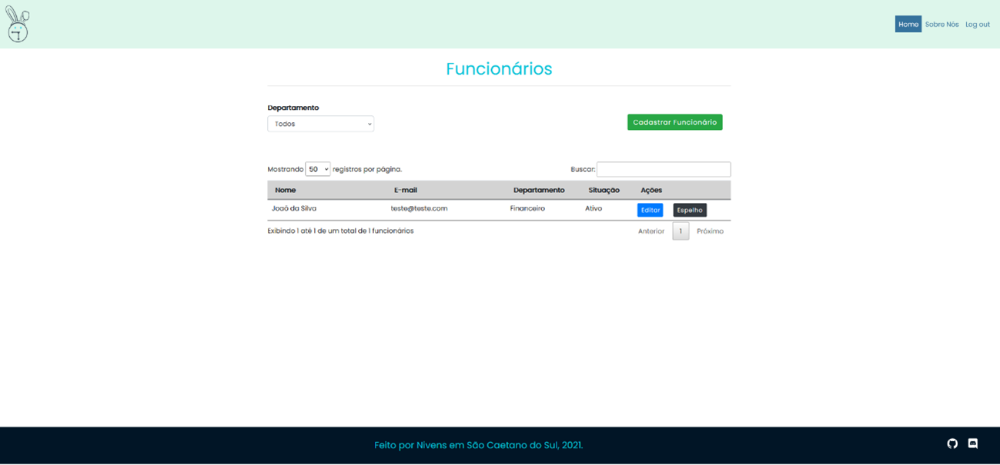
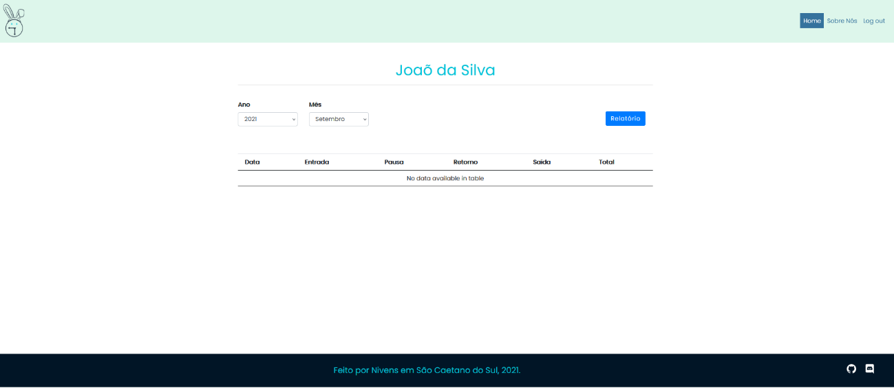

# Relatório

Para ter acesso ao relatório de pontos batidos de um funcionário é necessário estar logado(a).

Em seguida será aberta a página **Funcionários**:

Para visualizar o relatório de pontos clique na opção **Espelho** na frente do nome do funcionário que deseja consultar.

Você verá uma tela como esta:

É possível utilizar filtros de mês e ano para consultar os pontos batidos por um determinado funcionário.

Se desejar exportar os dados consultados, clique em **Relatório**. Essa operação fará o download dos dados em formato de planilha xlsx.